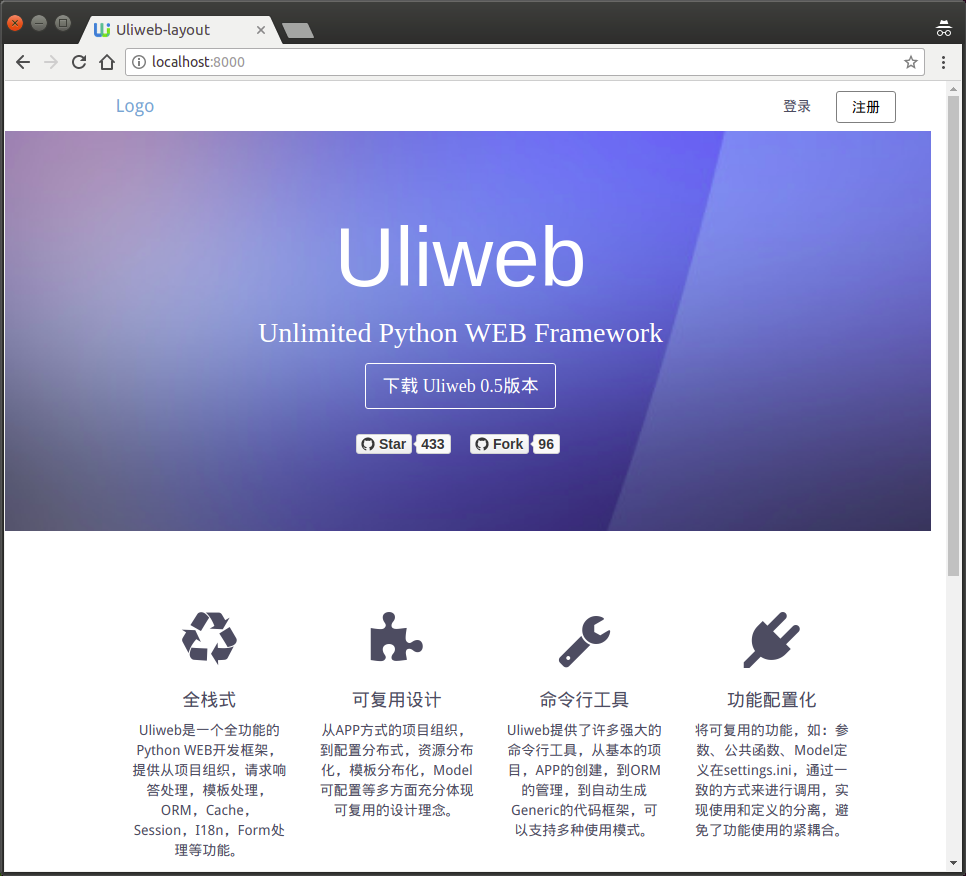

Usage:

- pip install -r requirements.txt
- uliweb runserver
- access http://localhost:8000 in browser

Depend on:

- [uliweb-apps](https://github.com/limodou/uliweb-apps)
- [uliweb-ui](https://github.com/uliwebext/uliweb-ui)
- [uliweb-layout](https://github.com/uliwebext/uliweb-layout)

Important related files and links:
- [inc_common_resource.html](https://github.com/uliwebext/uliweb-layout/blob/master/uliweb_layout/layout/templates/layout/include/inc_common_resource.html) in uliweb-layout.uliweb_layout.layout
  - include [AdminLTE](https://adminlte.io/themes/AdminLTE/index2.html) ( base on [Bootstrap3](https://getbootstrap.com/docs/3.3/) )
- There is [a full demo](https://github.com/limodou/uliweb-apps/tree/master/demo) in uliweb-apps source code

