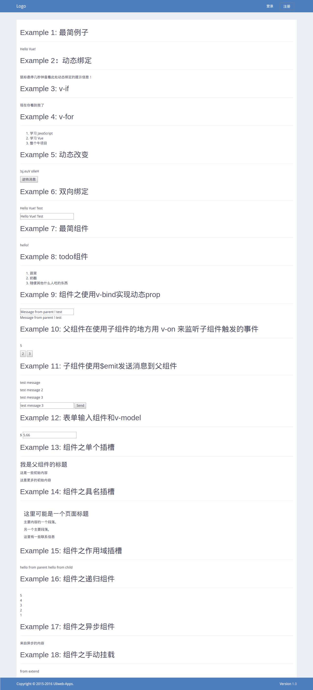

Usage:

- pip install -r requirements.txt
- uliweb runserver
- access http://localhost:8000 in browser

Depend on:

- [uliweb-apps](https://github.com/limodou/uliweb-apps)
- [uliweb-ui](https://github.com/uliwebext/uliweb-ui)
- [uliweb-layout](https://github.com/uliwebext/uliweb-layout)

Related links and files:

- [Vue.js](https://cn.vuejs.org)

